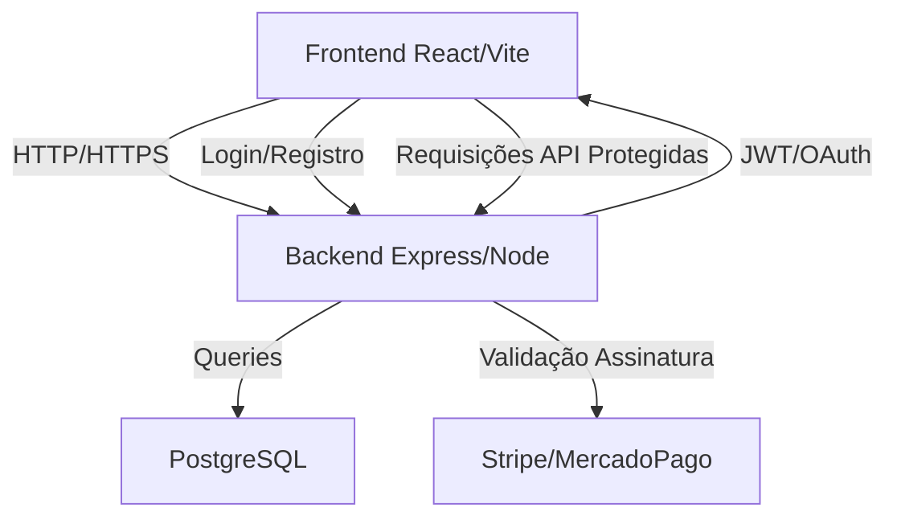

# 📚 Plataforma de Questões para Estudantes de Medicina

Projeto de assinatura mensal para estudantes de medicina, com banco de questões, simulados e estatísticas de desempenho.

---
vou precisar fazer o deploy do back e front e do banco de dados tbm! 
## 🚀 Stack Tecnológica

**Frontend**

OBS: Usar next ou nest deploy vercel

- React + TypeScript (Vite)
- Biblioteca UI: twailind
- Roteamento: React Router
- React Query (integração com API + cache)

**Backend**
OBS: Usar next ou nest Usar next ou nest deploy vercel
- Node.js + Express + TypeScript
- TypeORM (com migrations)
- Validação: Zod ou class-validator

**Banco de Dados**

- PostgreSQL

**Autenticação**

- Auth.js (NextAuth standalone) ou JWT + Refresh Token
- OAuth Google + E-mail/senha

**Pagamentos**

- Stripe (internacional)
- MercadoPago (AR + BR)

---

## 🛠 Arquitetura



# 📂 Estrutura de Pastas

```
### front
/front
    /src
        /components # Componentes reutilizáveis (botões, inputs, modais, etc.)
        /pages # Páginas do app (rotas principais)
        /hooks # Custom hooks
        /store # Estado global (Zustand/Redux)
        /services # Comunicação com backend (APIs)
        /utils # Funções auxiliares (formatadores, validadores)
    main.tsx # Ponto de entrada da aplicação
    App.tsx # Componente principal com rotas
````

## back
````
/back
    /src
        /db # Conexão e inicialização do banco de dados
        /config # Configurações (env, ORM, etc.)
        /controllers # Recebem requisições e chamam os services
        /services # Regras de negócio
        /middlewares # Interceptadores (auth, logs, validações)
        /routes # Definição das rotas da API
        /entities # Modelos do banco de dados (TypeORM Entities)
        /repositories # Consultas diretas ao banco (camada de persistência)
        /migrations # Scripts para versionamento do schema
        /dtos # Tipos de dados para entrada/saída (Data Transfer Objects)
    server.ts # Ponto de entrada do servidor Express

````

# 🗄 Modelo de Dados (PostgreSQL + TypeORM)

```
erDiagram
    USER {
        uuid id PK
        string name
        string email
        string password_hash
        string role
        datetime created_at
        datetime updated_at
    }

    SUBSCRIPTION {
        uuid id PK
        uuid user_id FK
        string status
        datetime start_date
        datetime end_date
        string provider
    }

    QUESTION {
        uuid id PK
        string discipline
        string topic
        text statement
        text options
        string correct_option
        text explanation
        datetime created_at
    }

    USER_ANSWER {
        uuid id PK
        uuid user_id FK
        uuid question_id FK
        string selected_option
        boolean is_correct
        datetime answered_at
    }

    USER ||--o{ SUBSCRIPTION : has
    USER ||--o{ USER_ANSWER : answers
    QUESTION ||--o{ USER_ANSWER : has
```

# 🔐 Fluxo de Autenticação (JWT + Refresh Token)

```
sequenceDiagram
    participant F as Frontend
    participant B as Backend
    participant DB as Database

    F->>B: POST /auth/login (email, senha)
    B->>DB: Valida credenciais
    DB-->>B: OK
    B-->>F: JWT + Refresh Token

    Note over F,B: Requisições autenticadas enviam JWT no header

    F->>B: JWT expirado
    B->>DB: Valida Refresh Token
    DB-->>B: OK
    B-->>F: Novo JWT
```


## 🔄 Fluxo Geral

1. **Frontend** (React) envia requisições para a API.
2. **Backend** (Express) recebe requisições → passa pelo middleware → chama controller.
3. **Controller** valida dados → chama service.
4. **Service** executa a lógica de negócio → usa repository para acessar o banco (PostgreSQL via TypeORM).
5. **Repository** retorna dados → service processa e envia para controller.
6. **Controller** responde para o frontend.


# Plano EXATO do que vou fazer para você
### Backend:
````
Cadastro, login, logout com JWT e refresh token.

Middleware de autenticação.

CRUD básico para questões.

Endpoint para buscar questões filtrando por disciplina e tópico.

Validação dos dados com Zod.

Estrutura organizada para futuras integrações (pagamentos, assinaturas).
````
### Frontend:
````
Tela de login e cadastro.

Persistência do JWT.

Proteção de rotas.

Tela para listar questões (com filtro).

Tela para responder questões e ver feedback.

Uso de React Query para cache e gerenciamento de chamadas API.

React Router para navegação.

Estado global com Zustand para armazenar info do usuário.

````


# 📌 Funcionalidades MVP

1. Cadastro e login (Google OAuth + e-mail/senha)
2. Banco de questões com filtros por disciplina e tema
3. Feedback imediato das respostas
4. Assinatura mensal via Stripe ou MercadoPago
5. Controle de acesso para assinantes ativos

# 📅 Próximos Passos

1. Estatísticas de desempenho
2. Simulados cronometrados
3. Ranking entre estudantes
4. App mobile (PWA)

# 📄 Licença

```
Projeto privado — todos os direitos reservados.
```


## Dependencias Back
npm install express cors pg typeorm reflect-metadata dotenv bcrypt jsonwebtoken
npm install -D typescript ts-node-dev @types/node @types/express @types/cors @types/jsonwebtoken @types/bcrypt


# 🚀 Rotas da API para Testes

## 🔐 Autenticação

| Método | Rota           | Descrição                | Corpo da Requisição (JSON)                               |
|--------|----------------|--------------------------|---------------------------------------------------------|
| POST   | `/auth/register` | Cadastro de usuário      | `{ "name": "string", "email": "string", "password": "string" }` |
| POST   | `/auth/login`    | Login                   | `{ "email": "string", "password": "string" }`           |
| POST   | `/auth/refresh`  | Refresh token           | `{ "refreshToken": "string" }`                           |

---

## 👤 Usuário

| Método | Rota          | Descrição                      |
|--------|---------------|--------------------------------|
| GET    | `/users/me`   | Obter dados do usuário logado (requer JWT no header) |

---

## 📚 Questões

| Método | Rota            | Descrição                          | Query Params Exemplo                             |
|--------|-----------------|----------------------------------|-------------------------------------------------|
| GET    | `/questions`    | Listar questões com filtros       | `?discipline=Cardiologia&topic=ECG`             |
| POST   | `/questions`    | Criar questão (requer permissão admin) | `{ "discipline": "...", "topic": "...", "statement": "...", "options": [...], "correct_option": "..." }` |
| GET    | `/questions/:id`| Detalhar uma questão              | —                                               |
| PUT    | `/questions/:id`| Atualizar questão (admin)         | —                                               |
| DELETE | `/questions/:id`| Deletar questão (admin)           | —                                               |

---

## 📝 Respostas dos Usuários

| Método | Rota           | Descrição                         | Corpo da Requisição (JSON)                         |
|--------|----------------|---------------------------------|---------------------------------------------------|
| POST   | `/answers`     | Registrar resposta do usuário     | `{ "questionId": "uuid", "selectedOption": "string" }` |
| GET    | `/answers/user`| Obter respostas do usuário logado | —                                                 |

---

## 💳 Assinaturas

| Método | Rota               | Descrição                         |
|--------|--------------------|---------------------------------|
| POST   | `/subscriptions`   | Criar assinatura (Stripe/MercadoPago) |
| GET    | `/subscriptions/user` | Verificar assinatura do usuário  |

---

### ⚠️ Observações importantes:

- Rotas protegidas exigem enviar token JWT no header:

